# Tarot System Architecture Diagrams

This document contains detailed architectural diagrams for the Tarot system components and data flows.

## System Overview

## Card Resolution Flow

## Secret Management Architecture

## Execution Mode Workflows

```mermaid
graph TB
    subgraph "Container Mode"
        C1[Single Task Entry] --> C2[Container Execution] --> C3[Task Complete]
    end
    
    subgraph "DAG Mode"
        D1[DAG Entry] --> D2[Parallel Task Execution]
        D2 --> D3[Task A]
        D2 --> D4[Task B]  
        D2 --> D5[Task C]
        D3 --> D6[Dependent Task D]
        D4 --> D6
        D5 --> D7[Final Task E]
        D6 --> D7
        D7 --> D8[DAG Complete]
    end
    
    subgraph "Steps Mode"  
        S1[Steps Entry] --> S2[Step 1: Parallel Tasks]
        S2 --> S3[Task A & B]
        S3 --> S4[Step 2: Sequential]
        S4 --> S5[Task C]
        S5 --> S6[Step 3: Final]
        S6 --> S7[Task D]
        S7 --> S8[Steps Complete]
    end
    
    subgraph "Suspend Mode"
        U1[Suspend Entry] --> U2[Initial Tasks]
        U2 --> U3[Approval Gate 🛑]
        U3 --> U4{Human Decision}
        U4 -->|Approved| U5[Continue Execution]
        U4 -->|Rejected| U6[Workflow Failed]
        U5 --> U7[Final Tasks]
        U7 --> U8[Suspend Complete]
    end
    
    style C1 fill:#e1f5fe
    style D1 fill:#e1f5fe
    style S1 fill:#e1f5fe
    style U1 fill:#e1f5fe
    
    style C3 fill:#e8f5e8
    style D8 fill:#e8f5e8
    style S8 fill:#e8f5e8
    style U8 fill:#e8f5e8
    
    style U3 fill:#ffebee
    style U6 fill:#ffebee
```

## Dependency Resolution Algorithm

## RBAC Security Model

## Data Flow Diagram

## Component Integration Map

## Performance & Scaling Considerations

---

*These diagrams provide a comprehensive view of the Tarot system architecture, showing how all components interact to create a powerful, secure, and scalable dynamic workflow framework.*