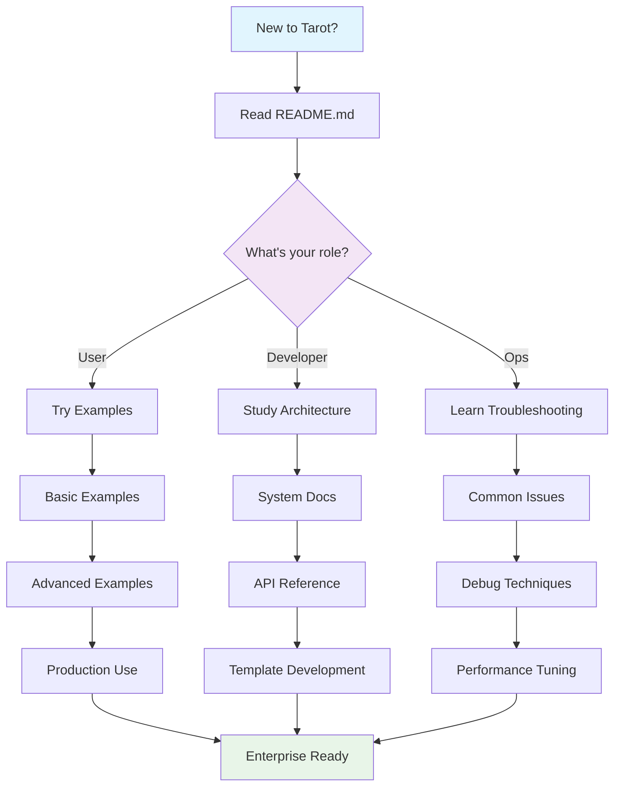
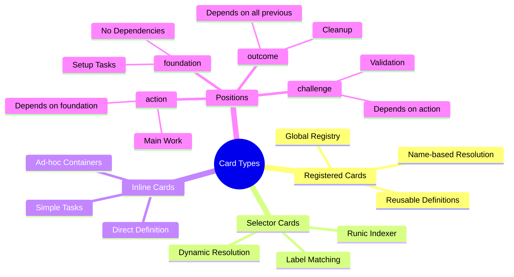

# Tarot System Documentation Index

Welcome to the comprehensive documentation for the Tarot system - a mystical-themed dynamic workflow framework for Kubernetes.

## 📚 Documentation Structure

### Core Documentation
| Document | Purpose | Audience |
|----------|---------|----------|
| **[README.md](./README.md)** | Quick start guide and overview | All users |
| **[TAROT_SYSTEM_DOCS.md](./TAROT_SYSTEM_DOCS.md)** | Complete system documentation with diagrams | Architects, developers |
| **[API_REFERENCE.md](./API_REFERENCE.md)** | Detailed configuration reference | Developers, operators |
| **[ARCHITECTURE.md](./ARCHITECTURE.md)** | Visual architecture diagrams | System architects |
| **[TROUBLESHOOTING.md](./TROUBLESHOOTING.md)** | Common issues and solutions | Operations teams |

### Practical Resources
| Resource | Purpose | Usage |
|----------|---------|-------|
| **[examples/](./examples/)** | Working configuration examples | Copy-paste starting points |
| **[values.yaml](./values.yaml)** | Default configuration values | Reference for available options |
| **[templates/](./templates/)** | Helm template implementation | Advanced customization |

## 🚀 Getting Started Journey

### 1. First-Time Users
1. Start with **[README.md](./README.md)** - Quick Start section
2. Try the `minimal-test.yaml` example
3. Review **[examples/](./examples/)** for your use case
4. Check **[TROUBLESHOOTING.md](./TROUBLESHOOTING.md)** if issues arise

### 2. System Designers
1. Read **[TAROT_SYSTEM_DOCS.md](./TAROT_SYSTEM_DOCS.md)** - Architecture section
2. Study **[ARCHITECTURE.md](./ARCHITECTURE.md)** diagrams
3. Review enterprise examples (`enterprise-approval.yaml`)
4. Plan integration using **[API_REFERENCE.md](./API_REFERENCE.md)**

### 3. Developers
1. Understand the card system in **[TAROT_SYSTEM_DOCS.md](./TAROT_SYSTEM_DOCS.md)**
2. Study template structure in **[templates/](./templates/)**
3. Use **[API_REFERENCE.md](./API_REFERENCE.md)** for configuration details
4. Test with examples and modify as needed

### 4. Operations Teams
1. Focus on **[TROUBLESHOOTING.md](./TROUBLESHOOTING.md)** for common issues
2. Review security sections in **[TAROT_SYSTEM_DOCS.md](./TAROT_SYSTEM_DOCS.md)**
3. Study RBAC configuration in **[API_REFERENCE.md](./API_REFERENCE.md)**
4. Monitor using production examples

## 🎯 Use Case Navigation

### Simple Workflows
- **Document**: [README.md](./README.md) - Quick Start
- **Example**: `minimal-test.yaml`
- **Mode**: Container

### CI/CD Pipelines
- **Document**: [TAROT_SYSTEM_DOCS.md](./TAROT_SYSTEM_DOCS.md) - Examples section
- **Example**: `basic-ci-custom.yaml`
- **Mode**: DAG

### ML/Data Pipelines
- **Document**: [TAROT_SYSTEM_DOCS.md](./TAROT_SYSTEM_DOCS.md) - ML Pipeline example
- **Example**: `complex-ml-pipeline.yaml`
- **Mode**: DAG with GPU scheduling

### Enterprise Workflows
- **Document**: [TAROT_SYSTEM_DOCS.md](./TAROT_SYSTEM_DOCS.md) - Enterprise section
- **Example**: `enterprise-approval.yaml`
- **Mode**: Suspend with approval gates

### Complex Dependencies
- **Document**: [ARCHITECTURE.md](./ARCHITECTURE.md) - Dependency Resolution
- **Example**: `mixed-cards-example.yaml`
- **Mode**: DAG or Steps

## 📊 Visual Learning Path



## 🎴 Card System Quick Reference



## 🔐 Security & Compliance Guide

| Security Aspect | Primary Document | Section |
|------------------|------------------|---------|
| **RBAC Setup** | [TAROT_SYSTEM_DOCS.md](./TAROT_SYSTEM_DOCS.md) | RBAC & Security |
| **Secret Management** | [TAROT_SYSTEM_DOCS.md](./TAROT_SYSTEM_DOCS.md) | Secret & Environment Management |
| **Vault Integration** | [API_REFERENCE.md](./API_REFERENCE.md) | Secret Types |
| **Approval Gates** | [examples/enterprise-approval.yaml](./examples/enterprise-approval.yaml) | Suspend mode |
| **Resource Limits** | [API_REFERENCE.md](./API_REFERENCE.md) | ResourceConfig |
| **Network Security** | [TROUBLESHOOTING.md](./TROUBLESHOOTING.md) | Security Features |

## 🛠️ Development & Customization

### Template Development
1. **Understanding Templates**: [templates/](./templates/) directory structure
2. **Helper Functions**: [templates/_helpers.tpl](./templates/_helpers.tpl)
3. **Card Resolution**: [templates/_card-resolver.tpl](./templates/_card-resolver.tpl)
4. **Secret Injection**: [templates/_secret-injector.tpl](./templates/_secret-injector.tpl)

### Testing Your Changes
```bash
# Test template rendering
helm template test charts/trinkets/tarot -f examples/minimal-test.yaml

# Validate all examples
for example in examples/*.yaml; do
  echo "Testing $example"
  helm template test charts/trinkets/tarot -f "$example" --dry-run
done

# Run comprehensive validation
make test-comprehensive
```

## 🔄 Integration Patterns

### With kast-system Components
- **Summon Integration**: Use Tarot for complex deployment workflows
- **Vault Glyph**: Leverage vault glyph for advanced secret management
- **Istio Glyph**: Integrate with service mesh configurations
- **ArgoCD**: Deploy via GitOps patterns

### With External Systems
- **GitHub Actions**: Use Tarot for complex CI workflows
- **Jenkins**: Replace complex pipeline scripts
- **Spinnaker**: Integrate deployment strategies
- **Tekton**: Alternative workflow engine integration

## 📈 Performance & Scaling

| Scenario | Recommendation | Documentation |
|----------|----------------|---------------|
| **Large Card Registry** | Use specific selectors | [TROUBLESHOOTING.md](./TROUBLESHOOTING.md) |
| **Complex Dependencies** | Break into smaller workflows | [ARCHITECTURE.md](./ARCHITECTURE.md) |
| **High-Memory Workloads** | Set resource limits | [API_REFERENCE.md](./API_REFERENCE.md) |
| **GPU Workloads** | Use node selectors | [examples/complex-ml-pipeline.yaml](./examples/complex-ml-pipeline.yaml) |
| **Multi-Cluster** | Template-based approach | [TAROT_SYSTEM_DOCS.md](./TAROT_SYSTEM_DOCS.md) |

## 🆘 Support & Community

### Getting Help
1. **Check Examples**: Most questions answered by existing examples
2. **Search Documentation**: Use Ctrl+F across all docs
3. **Debug Tools**: Follow [TROUBLESHOOTING.md](./TROUBLESHOOTING.md) procedures
4. **Community**: Join kast-system discussions

### Contributing
1. **Report Issues**: Use GitHub issues for bugs
2. **Request Features**: Document use cases clearly
3. **Submit Examples**: Share working configurations
4. **Improve Docs**: Documentation PRs welcome

## 📋 Quick Command Reference

```bash
# Installation
helm install my-workflow charts/trinkets/tarot -f config.yaml

# Testing
helm template test charts/trinkets/tarot -f config.yaml
helm lint charts/trinkets/tarot

# Debugging  
helm template debug charts/trinkets/tarot -f config.yaml --debug
kubectl get workflows -l kast.io/component=tarot
kubectl describe workflow <workflow-name>

# RBAC validation
kubectl auth can-i create workflows --as=system:serviceaccount:default:tarot-runner
```

---

## 🌟 Key Benefits Recap

- **🎨 Intuitive**: Card-based metaphor makes complex workflows understandable
- **🔗 Flexible**: Multiple execution modes for different patterns
- **🔐 Secure**: Enterprise-grade RBAC and secret management
- **📊 Visual**: Clear dependency graphs and execution flows
- **⚡ Powerful**: Supports CI/CD, ML, approval, and custom workflows
- **🧪 Tested**: 100% TDD compliance with comprehensive examples
- **📖 Documented**: Complete documentation with visual diagrams

*Welcome to the mystical world of Kubernetes workflow orchestration! ✨*