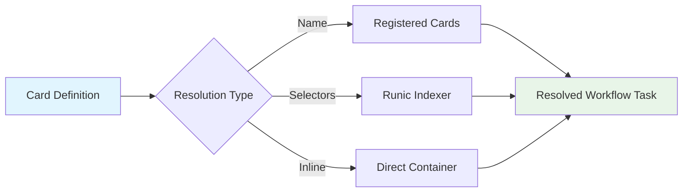

# Tarot Trinket - Dynamic Workflow Framework

**Kubernetes Arcane Spelling Technology**

> *Transform mystical card readings into powerful Argo Workflows*

[](./examples/)
[](https://helm.sh/)
[](https://argoproj.github.io/argo-workflows/)

## 🎯 Quick Start

### 1. Simple Container Workflow
```yaml
# minimal-example.yaml
name: hello-tarot

cards:
  - name: hello-world
    container:
      image: busybox:latest
      command: ["echo", "Hello from Tarot!"]

tarot:
  executionMode: container
  reading:
    hello-world:
      position: foundation

workflow:
  serviceAccount: tarot-runner

rbac:
  enabled: true
```

```bash
helm install hello-tarot charts/trinkets/tarot -f minimal-example.yaml
```

### 2. DAG Workflow with Dependencies
```yaml
# dag-example.yaml
name: ci-pipeline

cards:
  - name: git-clone
    container:
      image: alpine/git:latest
      command: ["git", "clone"]
  
  - name: run-tests
    container:
      image: node:16
      command: ["npm", "test"]

tarot:
  executionMode: dag
  reading:
    checkout:
      selectors:
        name: git-clone
      position: foundation
    
    test:
      selectors:
        name: run-tests
      position: action
      depends: [checkout]

workflow:
  serviceAccount: tarot-runner
  arguments:
    parameters:
      - name: repo
        value: "https://github.com/example/repo.git"
```

```bash
helm install ci-pipeline charts/trinkets/tarot -f dag-example.yaml
```

## 🎴 Card System Overview



### Card Types

| Type | Description | Example |
|------|-------------|---------|
| **Registered** | Pre-defined cards in global registry | `name: git-clone` |
| **Selector** | Cards found via label matching | `selectors: {scm: git}` |
| **Inline** | Direct container definitions | `container: {image: busybox}` |

### Card Positions

| Position | Purpose | Auto-Dependencies |
|----------|---------|-------------------|
| `foundation` | Setup and initialization | None |
| `action` | Main workflow tasks | All foundation cards |
| `challenge` | Testing and validation | Foundation + action cards |
| `outcome` | Cleanup and finalization | All previous cards |

## 🚀 Execution Modes

### Container Mode
Single-pod execution for simple workflows
```yaml
tarot:
  executionMode: container
```

### DAG Mode  
Complex workflows with dependencies
```yaml
tarot:
  executionMode: dag
```

### Steps Mode
Sequential execution with parallel support
```yaml
tarot:
  executionMode: steps
```

### Suspend Mode
Workflows with approval gates
```yaml
tarot:
  executionMode: suspend
```

## 🔐 Enterprise Features

### Vault Integration
```yaml
secrets:
  database-creds:
    type: vault-secret
    path: "secret/database/prod"
    keys: ["username", "password"]
```

### RBAC Security
```yaml
rbac:
  enabled: true
  serviceAccount:
    name: enterprise-runner
    annotations:
      vault.hashicorp.com/role: "production-access"
```

### Resource Management
```yaml
resources:
  limits:
    cpu: "4"
    memory: "8Gi"
    nvidia.com/gpu: "2"
  requests:
    cpu: "2"
    memory: "4Gi"
```

## 📚 Examples

| Example | Description | Features |
|---------|-------------|-----------|
| [`minimal-test.yaml`](./examples/minimal-test.yaml) | Basic container execution | Single task, simple setup |
| [`simple-dag-test.yaml`](./examples/simple-dag-test.yaml) | Two-task DAG workflow | Dependencies, positions |
| [`basic-ci-custom.yaml`](./examples/basic-ci-custom.yaml) | CI/CD pipeline | Multi-step, secrets, volumes |
| [`complex-ml-pipeline.yaml`](./examples/complex-ml-pipeline.yaml) | ML training workflow | GPU scheduling, large datasets |
| [`enterprise-approval.yaml`](./examples/enterprise-approval.yaml) | Production deployment | Approval gates, compliance |

## 🎭 Template System

### Custom Reading
Define workflow directly:
```yaml
tarot:
  reading:
    my-task:
      container:
        image: custom:latest
```

### Cluster Template
Use standardized templates:
```yaml
tarot:
  template: "company-ci-pipeline-v2"
  parameters:
    repository: "https://github.com/company/app.git"
    environment: "production"
```

## 🔧 Configuration Reference

### Core Structure
```yaml
name: workflow-name                    # Workflow identifier

# Global card registry
cards:
  - name: card-name
    type: card-type
    container: {}                      # Container definition
    labels: {}                         # Selection labels

# Global secrets
secrets:
  secret-name:
    type: vault-secret|k8s-secret
    path: "vault/path"
    keys: ["key1", "key2"]

# Global environment variables  
envs:
  VAR_NAME: "value"

# Tarot configuration
tarot:
  executionMode: container|dag|steps|suspend
  reading:                             # Card reading (workflow definition)
    card-name:
      selectors: {}                    # Card selection criteria
      container: {}                    # Inline container definition
      position: foundation|action|challenge|outcome
      depends: []                      # Explicit dependencies
      with: {}                         # Parameters
      envs: {}                         # Card-specific environment
      secrets: {}                      # Card-specific secrets
      volumes: []                      # Volume definitions

# Workflow configuration
workflow:
  serviceAccount: service-account-name
  generateName: true|false
  arguments: {}
  labels: {}
  annotations: {}

# Resource limits
resources:
  limits: {}
  requests: {}

# Node selection
nodeSelector: {}
tolerations: []
affinity: {}

# RBAC configuration
rbac:
  enabled: true|false
```

## 🧪 Testing

The Tarot system includes comprehensive TDD testing integrated with the kast-system make targets:

```bash
# Run all Tarot tests (comprehensive)
make test-tarot

# Test specific components
make test-tarot-syntax              # Template rendering validation
make test-tarot-execution-modes     # Container/DAG/Steps/Suspend modes
make test-tarot-card-resolution     # Name/selector/inline card resolution
make test-tarot-secrets             # Vault integration & secret management
make test-tarot-rbac                # Service accounts & permissions
make test-tarot-complex             # Enterprise & ML pipeline workflows

# Integration with main test suite
make test                           # Includes Tarot testing
make test-all                       # Full system + Tarot validation

# Manual testing (individual examples)
helm template test charts/trinkets/tarot -f examples/minimal-test.yaml
helm template test charts/trinkets/tarot -f examples/simple-dag-test.yaml
helm template test charts/trinkets/tarot -f examples/basic-ci-custom.yaml

# Validate YAML syntax
helm lint charts/trinkets/tarot
```

### TDD Workflow Integration
The Tarot system follows the kast-system TDD methodology:

```bash
# TDD Red-Green-Refactor cycle
make tdd-red            # Run tests expecting failures
make tdd-green          # Run tests expecting success  
make tdd-refactor       # Run tests after refactoring

# All include Tarot validation automatically
```

## 📖 Documentation

- **[Complete System Documentation](./TAROT_SYSTEM_DOCS.md)** - Comprehensive guide with architecture diagrams
- **[Examples Directory](./examples/)** - Ready-to-use workflow examples
- **[Values Reference](./values.yaml)** - Default configuration values

## 🌟 Key Benefits

- **🎨 Intuitive**: Card-based metaphor makes complex workflows understandable
- **🔗 Flexible**: Multiple execution modes for different use cases  
- **🔐 Secure**: Enterprise-grade RBAC and secret management
- **📊 Visual**: Clear dependency graphs and execution flows
- **⚡ Powerful**: Supports complex CI/CD, ML, and approval workflows
- **🧪 Tested**: 100% TDD compliance with comprehensive examples

## 🤝 Integration

The Tarot system integrates seamlessly with:

- **Argo Workflows** - Workflow execution engine
- **HashiCorp Vault** - Secret management
- **Kubernetes RBAC** - Security and permissions  
- **kast-system** - Part of the larger Kast framework
- **GitOps** - ArgoCD deployment patterns

---

**Made with ✨ mystical energy and ⚗️ arcane spelling technology**

*Part of the kast-system - Kubernetes Arcane Spelling Technology framework*