```mermaid
graph TD
    A[security-scan] --> B[security-approval 🛑]
    B --> C{Human Approval}
    C -->|Approved| D[deployment]
    C -->|Rejected| E[Workflow Failed]
    
    style B fill:#ffebee
    style C fill:#fff3e0
```

# Tarot System Documentation
## Kubernetes Arcane Spelling Technology - Dynamic Workflow Framework

**Version:** 1.0  
**Component:** Trinket  
**Type:** Dynamic Workflow Generator  

---

## Table of Contents

1. [Overview](#overview)
2. [Architecture](#architecture)
3. [Card System](#card-system)
4. [Execution Modes](#execution-modes)
5. [Secret & Environment Management](#secret--environment-management)
6. [Dependency Resolution](#dependency-resolution)
7. [Template Resolution](#template-resolution)
8. [RBAC & Security](#rbac--security)
9. [Examples & Use Cases](#examples--use-cases)
10. [Visual Diagrams](#visual-diagrams)

---

## Overview

The Tarot system is a mystical-themed dynamic workflow framework that transforms card-based configurations into Argo Workflow resources. It provides an intuitive abstraction layer for creating complex, interdependent Kubernetes workflows while maintaining enterprise-grade security and compliance.

### Key Features

- **🎴 Card-Based Workflow Definition**: Define workflow steps as mystical cards with positions and dependencies
- **🔀 Multiple Execution Modes**: Container, DAG, Steps, Suspend, Resource, and Script modes
- **🔐 Enterprise Security**: Vault integration, RBAC, and secret management
- **📊 Complex Dependencies**: Position-based and explicit dependency resolution
- **🎭 Template System**: Cluster-wide template resolution with parameter injection
- **⚖️ Compliance Ready**: Approval gates, audit trails, and enterprise governance

---

## Architecture


### Core Components

| Component | Purpose | Key Features |
|-----------|---------|--------------|
| **Card Resolver** | Resolves card definitions from names, selectors, or inline | Name lookup, selector matching, inline containers |
| **Secret Injector** | Manages secrets and environment variables | Vault integration, hierarchical merging, volume mounting |
| **Template Resolver** | Handles cluster-wide template resolution | Parameter injection, runic indexer integration |
| **Workflow Generator** | Creates Argo Workflow resources | Multi-mode execution, dependency resolution |
| **RBAC System** | Enterprise security and permissions | Cluster-wide access, workflow management |

---

## Card System

The Tarot system uses a card-based metaphor where each workflow step is represented as a mystical card with specific properties and positions.

### Card Resolution Hierarchy


### Card Types

#### 1. Registered Cards
Cards defined in the global `cards` array:

```yaml
cards:
  - name: git-clone
    type: scm
    container:
      image: alpine/git:latest
      command: ["git", "clone"]
    labels:
      scm: git
      default: cluster
```

#### 2. Selector-Based Cards
Cards resolved using the Runic Indexer:

```yaml
tarot:
  reading:
    checkout:
      selectors:
        scm: git
        operation: clone
      with:
        repository: "https://github.com/example/repo.git"
```

#### 3. Inline Cards
Direct container definitions:

```yaml
tarot:
  reading:
    custom-task:
      container:
        image: busybox:latest
        command: ["echo", "Hello Tarot"]
```

### Card Positions

Cards follow mystical positions that define execution order and dependencies:

| Position | Description | Auto-Dependencies |
|----------|-------------|-------------------|
| `foundation` | Initial setup tasks | None |
| `action` | Main execution tasks | All foundation cards |
| `challenge` | Validation/testing tasks | All action + foundation cards |
| `outcome` | Final tasks and cleanup | All previous position cards |

---

## Execution Modes

The Tarot system supports multiple execution modes to handle different workflow patterns:

### 1. Container Mode
Single-pod execution for simple workflows:

```yaml
tarot:
  executionMode: container
  reading:
    hello-world:
      container:
        image: busybox:latest
        command: ["echo", "Hello World"]
```

**Generated Workflow:**


### 2. DAG Mode
Directed Acyclic Graph for complex dependencies:

```yaml
tarot:
  executionMode: dag
  reading:
    checkout:
      position: foundation
    build:
      position: action
      depends: [checkout]
    test:
      position: challenge
      depends: [build]
    deploy:
      position: outcome
      depends: [test]
```

**Generated Workflow:**


### 3. Steps Mode
Sequential execution with parallel capabilities:

```yaml
tarot:
  executionMode: steps
  reading:
    parallel-tests:
      position: action
    integration-tests:
      position: action
    deployment:
      position: outcome
```

**Generated Workflow:**


### 4. Suspend Mode
Approval gates and human intervention:

```yaml
tarot:
  executionMode: suspend
  reading:
    security-scan:
      position: foundation
    security-approval:
      container:
        image: approval/gate:latest
      suspend:
        duration: "24h"
        approvers: ["security-team@company.com"]
        message: "Security approval required"
      position: challenge
    deployment:
      position: outcome
```

**Generated Workflow:**


---

## Secret & Environment Management

The Tarot system provides hierarchical secret and environment variable management with enterprise-grade security.

### Secret Types

#### 1. Vault Secrets
Integration with HashiCorp Vault:

```yaml
secrets:
  database-creds:
    type: vault-secret
    path: "secret/database/production"
    keys: ["username", "password", "connection_string"]
    mount: "/secrets/db"
```

#### 2. Kubernetes Secrets
Direct K8s secret references:

```yaml
secrets:
  registry-auth:
    type: k8s-secret
    name: docker-registry-secret
    keys: ["username", "password"]
```

### Environment Variable Injection


### Secret Injection Example

```yaml
# Global environment variables
envs:
  APP_ENV: "production"
  LOG_LEVEL: "info"

# Global secrets
secrets:
  vault-db:
    type: vault-secret
    path: "secret/database/prod"
    keys: ["username", "password"]

tarot:
  reading:
    api-deployment:
      container:
        image: myapp:latest
      # Card-specific environment
      envs:
        SERVICE_NAME: "api-gateway"
      # Card-specific secrets
      secrets:
        app-config:
          type: k8s-secret
          name: app-configuration
          keys: ["config.json"]
          mount: "/config"
```

**Resulting Environment:**
```bash
# From global envs
APP_ENV=production
LOG_LEVEL=info

# From card envs
SERVICE_NAME=api-gateway

# From vault secret (vault-db)
VAULT-DB_USERNAME=<vault-value>
VAULT-DB_PASSWORD=<vault-value>

# Volume mounts:
# /secrets/vault-db (from vault secret)
# /config (from k8s secret)
```

---

## Dependency Resolution

The Tarot system uses a sophisticated dependency resolution system combining explicit dependencies with position-based automatic dependencies.

### Dependency Types


### Dependency Examples

#### Position-Based Dependencies
```yaml
tarot:
  reading:
    setup-db:
      position: foundation      # No auto-dependencies
    
    migrate-db:
      position: action          # Auto-depends on: setup-db
    
    run-tests:
      position: challenge       # Auto-depends on: setup-db, migrate-db
    
    deploy-app:
      position: outcome         # Auto-depends on: setup-db, migrate-db, run-tests
```

#### Explicit Dependencies
```yaml
tarot:
  reading:
    checkout:
      position: foundation
    
    build-frontend:
      position: action
      depends: [checkout]       # Only depends on checkout
    
    build-backend:
      position: action
      depends: [checkout]       # Only depends on checkout
    
    integration-test:
      position: challenge
      depends: [build-frontend, build-backend]  # Explicit dependencies override position-based
```

#### Complex Dependency Graph


---

## Template Resolution

The Tarot system supports cluster-wide template resolution for enterprise scenarios where workflows are standardized across the organization.

### Template Types

#### 1. Custom Reading
Direct card definition in the configuration:

```yaml
tarot:
  reading:
    custom-task:
      container:
        image: custom:latest
```

#### 2. Cluster Template
Reference to standardized workflow template:

```yaml
tarot:
  template: "ci-pipeline-v2"
  parameters:
    repository: "https://github.com/company/app.git"
    environment: "production"
```

### Template Resolution Flow


### Runic Indexer Integration

The Runic Indexer enables powerful card selection using labels and selectors:

```yaml
# Available cards in the cluster
cards:
  - name: git-clone
    labels:
      scm: git
      operation: clone
      language: any
      default: cluster
    
  - name: maven-build
    labels:
      build: maven
      language: java
      default: cluster
    
  - name: docker-build
    labels:
      build: docker
      container: true
      default: cluster

# Card selection using selectors
tarot:
  reading:
    source-checkout:
      selectors:
        scm: git
        operation: clone
    
    java-build:
      selectors:
        build: maven
        language: java
    
    containerize:
      selectors:
        build: docker
        container: true
```

---

## RBAC & Security

The Tarot system implements enterprise-grade security with comprehensive RBAC and secret management.

### RBAC Architecture


### Security Features

#### 1. Service Account Management
```yaml
rbac:
  enabled: true
  serviceAccount:
    name: tarot-runner
    annotations:
      vault.hashicorp.com/role: "tarot-vault-role"
```

#### 2. Cluster-Wide Template Access
```yaml
# Cluster role for template resolution
clusterRole:
  rules:
    - apiGroups: ["argoproj.io"]
      resources: ["clusterworkflowtemplates"]
      verbs: ["get", "list", "watch"]
```

#### 3. Vault Integration
```yaml
secrets:
  production-creds:
    type: vault-secret
    path: "secret/production/database"
    role: "tarot-runner"
    keys: ["username", "password"]
```

### Security Best Practices

| Area | Practice | Implementation |
|------|----------|----------------|
| **Secret Management** | Use Vault for sensitive data | `vault-secret` type with role-based access |
| **Network Security** | Isolate workflow pods | NetworkPolicies in examples |
| **Resource Limits** | Prevent resource exhaustion | Resource limits in card definitions |
| **Audit Trail** | Track workflow execution | Labels and annotations on all resources |
| **Approval Gates** | Human approval for critical tasks | Suspend mode with approval configuration |

---

## Examples & Use Cases

### Enterprise CI/CD Pipeline

```yaml
name: enterprise-ci-pipeline

secrets:
  github-token:
    type: vault-secret
    path: "secret/github/ci"
    keys: ["token"]
  
  registry-creds:
    type: vault-secret
    path: "secret/registry/production"
    keys: ["username", "password"]

envs:
  REGISTRY_URL: "registry.company.com"
  BUILD_CONTEXT: "/workspace"

cards:
  - name: git-clone
    container:
      image: alpine/git:latest
      command: ["git", "clone"]

tarot:
  executionMode: dag
  reading:
    checkout:
      selectors:
        scm: git
        operation: clone
      position: foundation
      with:
        repository: "{{workflow.parameters.repo}}"
    
    security-scan:
      container:
        image: aquasec/trivy:latest
        command: ["trivy", "fs"]
        args: ["--exit-code", "1", "/workspace"]
      position: action
      depends: [checkout]
    
    build-image:
      container:
        image: quay.io/buildah/stable:latest
        command: ["buildah", "build"]
        args: ["--tag", "{{envs.REGISTRY_URL}}/app:{{workflow.parameters.tag}}"]
      position: action
      depends: [security-scan]
      resources:
        limits:
          cpu: "2"
          memory: "4Gi"
    
    deploy:
      container:
        image: kubectl:latest
        command: ["kubectl", "apply"]
        args: ["-f", "manifests/"]
      position: outcome
      depends: [build-image]

workflow:
  serviceAccount: enterprise-ci
  arguments:
    parameters:
      - name: repo
        value: "https://github.com/company/app.git"
      - name: tag
        value: "latest"
```

### ML Pipeline with GPU Scheduling

```yaml
name: ml-training-pipeline

envs:
  MODEL_TYPE: "transformer"
  DATASET_PATH: "/data/training"
  MODEL_OUTPUT: "/models/output"

tarot:
  executionMode: dag
  reading:
    data-preparation:
      container:
        image: python:3.9-slim
        command: ["python", "prepare_data.py"]
        resources:
          requests:
            memory: "8Gi"
            cpu: "4"
      position: foundation
      volumes:
        - name: training-data
          type: persistentVolumeClaim
          size: "100Gi"
          mountPath: /data
    
    model-training:
      container:
        image: pytorch/pytorch:latest
        command: ["python", "train_model.py"]
        resources:
          requests:
            nvidia.com/gpu: "2"
            memory: "32Gi"
          limits:
            nvidia.com/gpu: "2"
            memory: "32Gi"
      position: action
      depends: [data-preparation]
      nodeSelector:
        gpu: "true"
        gpu-type: "v100"
    
    model-evaluation:
      container:
        image: python:3.9-slim
        command: ["python", "evaluate_model.py"]
      position: challenge
      depends: [model-training]
    
    model-deployment:
      container:
        image: kubeflow/pytorch-serving:latest
        command: ["deploy-model"]
      position: outcome
      depends: [model-evaluation]
```

---

## Visual Diagrams

### Overall System Flow


### Execution Mode Comparison

```mermaid
graph TD
    subgraph "Container Mode"
        A1[Single Task] --> A2[Direct Execution]
    end
    
    subgraph "DAG Mode"
        B1[Task A] --> B2[Task B]
        B1 --> B3[Task C]
        B2 --> B4[Task D]
        B3 --> B4
    end
    
    subgraph "Steps Mode"
        C1[Step 1: Task A & B] --> C2[Step 2: Task C] --> C3[Step 3: Task D]
    end
    
    subgraph "Suspend Mode"
        D1[Task A] --> D2[Approval Gate 🛑] --> D3[Task B]
    end
    
    style A1 fill:#e1f5fe
    style B1 fill:#f3e5f5
    style B2 fill:#f3e5f5
    style B3 fill:#f3e5f5
    style B4 fill:#e8f5e8
    style C1 fill:#f3e5f5
    style C2 fill:#fff3e0
    style C3 fill:#e8f5e8
    style D1 fill:#f3e5f5
    style D2 fill:#ffebee
    style D3 fill:#e8f5e8
```



### Card Resolution Process


This comprehensive documentation provides a complete understanding of the Tarot system's architecture, capabilities, and usage patterns. The visual diagrams help illustrate the complex interdependencies and make the system accessible to both developers and operators.