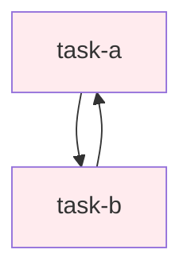
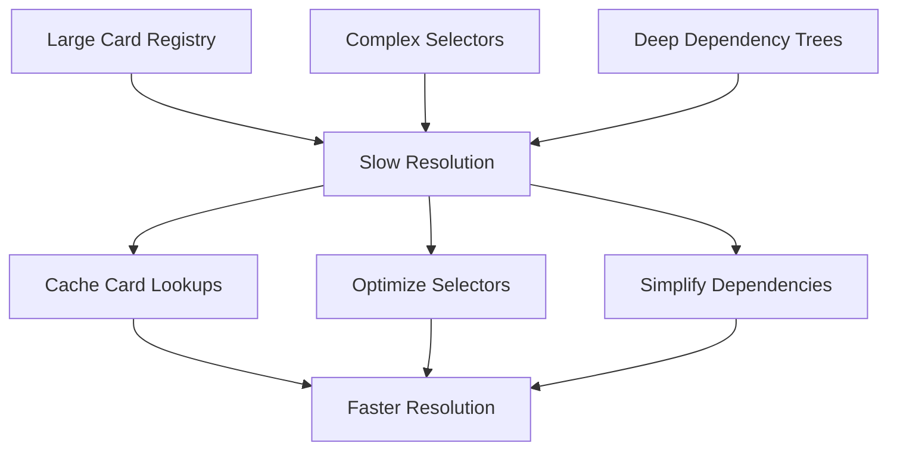

# Tarot System Troubleshooting Guide

This guide helps diagnose and resolve common issues with the Tarot system.

## 🔍 Quick Diagnostics

### Check System Status
```bash
# Test basic template rendering
helm template test charts/trinkets/tarot -f examples/minimal-test.yaml

# Validate YAML syntax
helm lint charts/trinkets/tarot

# Check RBAC permissions
kubectl auth can-i create workflows --as=system:serviceaccount:default:tarot-runner
```

### Debug Workflow Execution
```bash
# Check workflow status
kubectl get workflows -l kast.io/component=tarot

# View workflow details
kubectl describe workflow <workflow-name>

# Check workflow logs
kubectl logs -l workflows.argoproj.io/workflow=<workflow-name>
```

## ❌ Common Issues & Solutions

### 1. Card Resolution Failures

#### Issue: `Card 'card-name' not found`
```
Error: execution error at (tarot/templates/workflow.yaml:19:24): 
Card 'my-card' not found and no valid definition provided
```

**Diagnosis:**
```bash
# Check if card is registered
helm template debug charts/trinkets/tarot -f your-config.yaml --debug | grep -A 10 "cards:"

# Verify card definition
grep -A 10 "name: my-card" your-config.yaml
```

**Solutions:**
1. **Register the card globally:**
   ```yaml
   cards:
     - name: my-card
       container:
         image: appropriate:image
   ```

2. **Use selectors instead:**
   ```yaml
   tarot:
     reading:
       my-task:
         selectors:
           type: my-card-type
   ```

3. **Define inline:**
   ```yaml
   tarot:
     reading:
       my-task:
         container:
           image: busybox:latest
           command: ["echo", "hello"]
   ```

### 2. Template Rendering Errors

#### Issue: YAML Parse Errors
```
Error: YAML parse error on tarot/templates/workflow.yaml: 
error converting YAML to JSON: yaml: line 57: mapping values are not allowed
```

**Diagnosis:**
```bash
# Use debug mode to see rendered output
helm template debug charts/trinkets/tarot -f your-config.yaml --debug

# Check for YAML structure issues
yamllint your-config.yaml
```

**Solutions:**
1. **Check indentation:**
   ```yaml
   # Correct
   tarot:
     reading:
       task-name:
         container:
           image: busybox:latest
   
   # Incorrect (mixed tabs/spaces)
   tarot:
   	reading:
       task-name:
   		container:
           image: busybox:latest
   ```

2. **Validate quotes in strings:**
   ```yaml
   # Correct
   command: ["echo", "hello world"]
   
   # Incorrect (unescaped quotes)
   command: ["echo", "he said "hello""]
   ```

### 3. Secret Management Issues

#### Issue: Vault Secrets Not Accessible
```
Error: secrets "tarot-vault-secret" is forbidden: 
User "system:serviceaccount:default:tarot-runner" cannot get resource "secrets"
```

**Diagnosis:**
```bash
# Check service account permissions
kubectl auth can-i get secrets --as=system:serviceaccount:default:tarot-runner

# Verify Vault role configuration
kubectl describe serviceaccount tarot-runner

# Check Vault auth status
vault auth -method=kubernetes role=tarot-runner
```

**Solutions:**
1. **Enable RBAC:**
   ```yaml
   rbac:
     enabled: true
   ```

2. **Configure Vault authentication:**
   ```yaml
   rbac:
     serviceAccount:
       annotations:
         vault.hashicorp.com/role: "tarot-vault-role"
   ```

3. **Check secret type:**
   ```yaml
   secrets:
     my-secret:
       type: vault-secret  # Correct
       # type: vault        # Incorrect
       path: "secret/path"
   ```

### 4. Dependency Resolution Problems

#### Issue: Circular Dependencies
```
Error: dependency cycle detected: task-a -> task-b -> task-a
```

**Diagnosis:**


**Solutions:**
1. **Review dependency chain:**
   ```yaml
   tarot:
     reading:
       task-a:
         depends: [task-c]  # Remove circular reference
         position: action
       
       task-b:
         depends: [task-a]
         position: challenge
       
       task-c:
         position: foundation  # Add intermediate step
   ```

2. **Use positions to avoid explicit dependencies:**
   ```yaml
   tarot:
     reading:
       setup:
         position: foundation    # Runs first
       
       process:
         position: action        # Runs after foundation
       
       cleanup:
         position: outcome       # Runs after action
   ```

### 5. Execution Mode Issues

#### Issue: DAG Tasks Not Running in Parallel
```
Tasks that should run in parallel are executing sequentially
```

**Diagnosis:**
```bash
# Check workflow DAG structure
kubectl get workflow <workflow-name> -o yaml | grep -A 20 "dag:"

# Verify no accidental dependencies
helm template debug charts/trinkets/tarot -f your-config.yaml | grep -A 10 "dependencies:"
```

**Solutions:**
1. **Remove unnecessary dependencies:**
   ```yaml
   tarot:
     reading:
       parallel-task-a:
         position: action
         # depends: [setup]  # Remove if not needed
       
       parallel-task-b:
         position: action
         # depends: [setup]  # Remove if not needed
   ```

2. **Use explicit DAG mode:**
   ```yaml
   tarot:
     executionMode: dag  # Ensure DAG mode is set
   ```

### 6. Resource Limit Issues

#### Issue: Pods Stuck in Pending State
```
Pod status: Pending
Reason: Insufficient memory/cpu
```

**Diagnosis:**
```bash
# Check pod events
kubectl describe pod <pod-name>

# Check node resources
kubectl describe nodes

# Check resource requests/limits
kubectl get pod <pod-name> -o yaml | grep -A 10 "resources:"
```

**Solutions:**
1. **Adjust resource requests:**
   ```yaml
   tarot:
     reading:
       memory-intensive-task:
         container:
           image: ml-training:latest
           resources:
             requests:
               memory: "4Gi"      # Reduce if too high
               cpu: "2"
             limits:
               memory: "8Gi"
               cpu: "4"
   ```

2. **Add node selectors:**
   ```yaml
   nodeSelector:
     node-type: "high-memory"
   
   tolerations:
     - key: "dedicated"
       operator: "Equal"
       value: "ml-workloads"
       effect: "NoSchedule"
   ```

### 7. Approval Gate Issues

#### Issue: Suspend Mode Not Working
```
Approval gates are not pausing workflow execution
```

**Diagnosis:**
```bash
# Check suspend configuration
helm template debug charts/trinkets/tarot -f your-config.yaml | grep -A 10 "suspend:"

# Verify execution mode
grep "executionMode" your-config.yaml
```

**Solutions:**
1. **Set correct execution mode:**
   ```yaml
   tarot:
     executionMode: suspend  # Required for approval gates
   ```

2. **Provide container AND suspend config:**
   ```yaml
   tarot:
     reading:
       approval-gate:
         container:               # Required even for suspend tasks
           image: approval/gate:latest
           command: ["approval-gate"]
         suspend:
           duration: "24h"
           approvers: ["team@company.com"]
   ```

## 🛠️ Debugging Tools

### Template Inspection
```bash
# View complete rendered template
helm template debug charts/trinkets/tarot -f your-config.yaml --debug

# Extract specific sections
helm template debug charts/trinkets/tarot -f your-config.yaml | yq '.spec.templates'

# Check secret generation
helm template debug charts/trinkets/tarot -f your-config.yaml | grep -A 10 "kind: Secret"
```

### Card Resolution Testing
```bash
# Test card registry
helm template test charts/trinkets/tarot --set 'cards[0].name=test-card' --set 'cards[0].container.image=busybox'

# Test selectors
helm template test charts/trinkets/tarot \
  --set 'cards[0].name=test-card' \
  --set 'cards[0].labels.type=test' \
  --set 'tarot.reading.my-task.selectors.type=test'
```

### RBAC Validation
```bash
# Test service account permissions
kubectl auth can-i create workflows --as=system:serviceaccount:default:tarot-runner
kubectl auth can-i get secrets --as=system:serviceaccount:default:tarot-runner
kubectl auth can-i get clusterworkflowtemplates --as=system:serviceaccount:default:tarot-runner

# Check role bindings
kubectl get rolebindings -o wide | grep tarot
kubectl get clusterrolebindings -o wide | grep tarot
```

## 📊 Performance Issues

### Slow Card Resolution


**Solutions:**
1. **Optimize card registry:**
   ```yaml
   cards:
     # Group related cards
     - name: git-clone-basic
       labels: {scm: git, complexity: simple}
     - name: git-clone-advanced  
       labels: {scm: git, complexity: advanced}
   ```

2. **Use specific selectors:**
   ```yaml
   # Specific (fast)
   selectors:
     name: exact-card-name
   
   # Generic (slower)
   selectors:
     type: generic-type
   ```

### High Memory Usage
```bash
# Monitor workflow resource usage
kubectl top pods -l workflows.argoproj.io/workflow=<workflow-name>

# Check workflow complexity
kubectl get workflow <workflow-name> -o yaml | grep -c "templates:"
```

**Solutions:**
1. **Break large workflows into smaller ones:**
   ```yaml
   # Instead of one large workflow
   tarot:
     reading:
       # 50+ tasks here
   
   # Use multiple smaller workflows
   # Workflow 1: data-preparation
   # Workflow 2: model-training  
   # Workflow 3: deployment
   ```

2. **Use resource limits:**
   ```yaml
   resources:
     limits:
       memory: "1Gi"
       cpu: "500m"
   ```

## 🆘 Getting Help

### Collect Debug Information
```bash
#!/bin/bash
# debug-info-collector.sh

echo "=== Tarot Debug Information ==="
echo "Date: $(date)"
echo "Helm Version: $(helm version --short)"
echo "Kubernetes Version: $(kubectl version --short)"
echo ""

echo "=== Template Rendering ==="
helm template debug charts/trinkets/tarot -f your-config.yaml --debug

echo "=== RBAC Status ==="
kubectl auth can-i create workflows --as=system:serviceaccount:default:tarot-runner
kubectl auth can-i get secrets --as=system:serviceaccount:default:tarot-runner

echo "=== Workflow Status ==="
kubectl get workflows -l kast.io/component=tarot

echo "=== Recent Events ==="
kubectl get events --sort-by='.lastTimestamp' | grep -i tarot

echo "=== Node Resources ==="
kubectl describe nodes | grep -A 5 "Allocated resources"
```

### Common Configuration Validation
```yaml
# checklist.yaml - Validate your configuration against this checklist

# ✅ Required fields
name: "your-workflow-name"                    # Required
tarot:                                        # Required
  executionMode: "dag"                        # Required: container|dag|steps|suspend
  reading:                                    # Required if not using template
    task-name:                                # At least one task required
      # One of these is required:
      container: {}                           # Inline container
      selectors: {}                           # Card selectors
      # name reference works only if card exists in global cards[]

# ✅ RBAC (recommended)
rbac:
  enabled: true                               # Recommended for production

# ✅ Workflow configuration (recommended)  
workflow:
  serviceAccount: "tarot-runner"              # Recommended
  generateName: true                          # Recommended for multiple runs

# ✅ Resource management (recommended for production)
resources:
  limits:
    memory: "2Gi"
    cpu: "1"
  requests:
    memory: "1Gi" 
    cpu: "500m"
```

### Support Channels

1. **Documentation**: Check [TAROT_SYSTEM_DOCS.md](./TAROT_SYSTEM_DOCS.md) for comprehensive guidance
2. **Examples**: Review [examples/](./examples/) directory for working configurations
3. **GitHub Issues**: Report bugs and feature requests
4. **Community**: Join the kast-system community discussions

---

*Remember: The Tarot system is designed to be intuitive, but complex workflows require careful planning. When in doubt, start with simple examples and gradually increase complexity.*